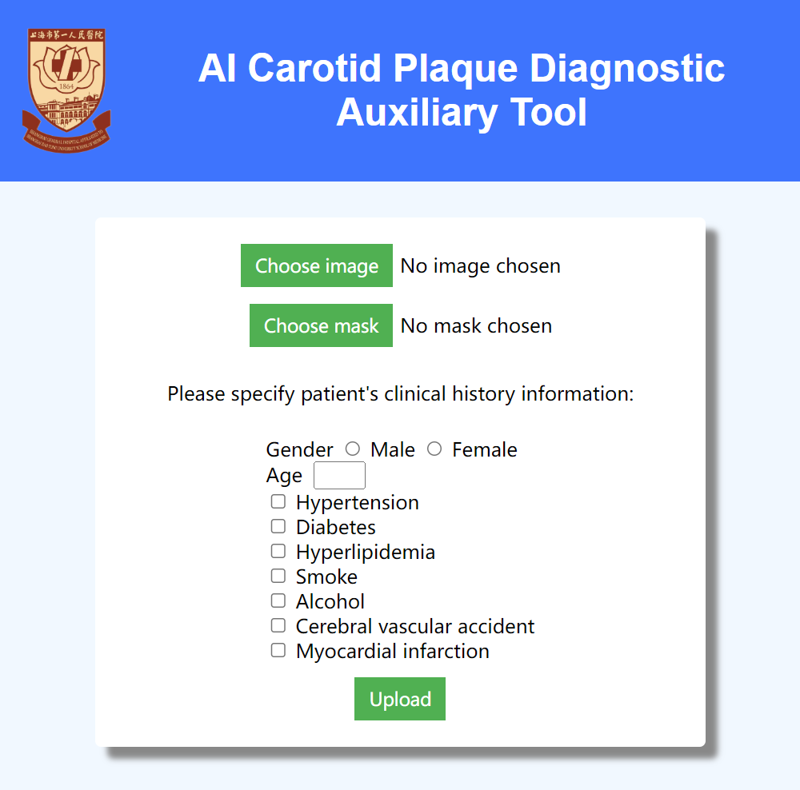
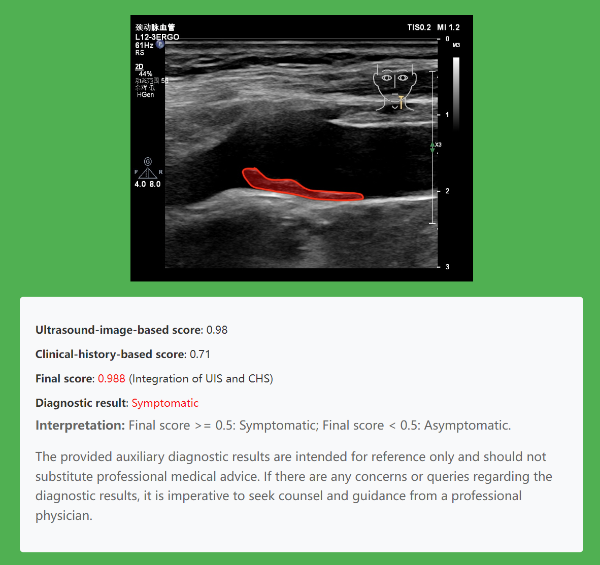

# Capstone-Design-Relation-of-Carotid-Features-Detected-with-Ultrasound-Imaging-to-Clinical-Symptoms

This is the UM-SJTU Join Institute VE450 Capstone Design project. Please refer to "毕业论文" for detail.

# Abstract

Carotid plaques are fatty deposits accumulating in neck blood vessels. As a predominant
cause of stroke, it requires timely detection and intervention. Ultrasound
imaging serves as the first-line detection tool, which is cost-effective but relies
on senior radiologists to read and interpret. The project is to develop softwarebased
methods, to extract features and predict clinical symptoms in neck ultrasound
images. Based on the literature we collected, we compared the current
existing benchmarks in this field with relevant evaluation metrics included, and
summarized mainstream methods in their experiments. Based on limited 322 ultrasound
images, we managed to build a machine-learning-based model, which incorporates
convolutional neural network for image input and decision tree model
for patients’ clinical history data. The final test accuracy reaches 80.56%, which
meets the requirement of our sponsor. Also, on this basis, we designed a simple
web application for user interaction, so that users can check the output results of
the model. We hope our design will make a difference in automatic diagnosis of
carotid plaque in the future.

# Preparation

The required packages for this project have been listed in the requirements.txt file. You can simply run the following command for preparation. The trained deep learning model has already been added in this repository. Hence, you do not need to install pytorch+CUDA if you just want to have a try of intelligent diagnosis. 

```python
`pip install -r requirements.txt
```

# Usage

- Run the application.py file first.

```python
python application.py
```

- Go to [http://127.0.0.1:5000](http://127.0.0.1:5000/), you will see a website page like:



- Push "Choose image" and go to **data/delineated** to choose a delineated image.

- Push "Choose mask" and go to data/mask to choose a mask image. **Make sure the delineate and mask image come from the same client!**  

- Move to data/client_info.xlsx to look for basic information and medical history of the client you choose before by "**image_num**" term.

# Result

The diagnostic result should be like this:



# Contributors

Mentor: Prof. Sungliang Chen

Section Instructor: Prof. Peisen Huang

Member:

- Yi Xia
- Yu Sun
- Zeyu Zhang
- Zicong Xiao
- Zihao Xu

